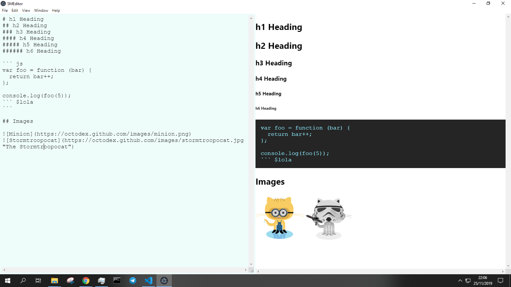

# Proyecto Editor Simple Markdown a HTML

## Dependencias
- electron
- marked

## Uso

- Descargar el proyecto
- ejecutar "npm install"
- ejecutar npm start para ejecutar el proyecto en modo desarrollo

## Imágenes

# Autor
> Stalin Maza